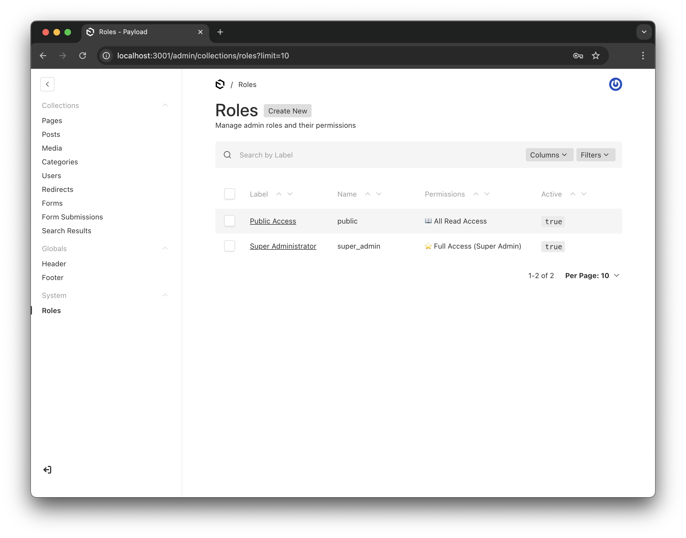
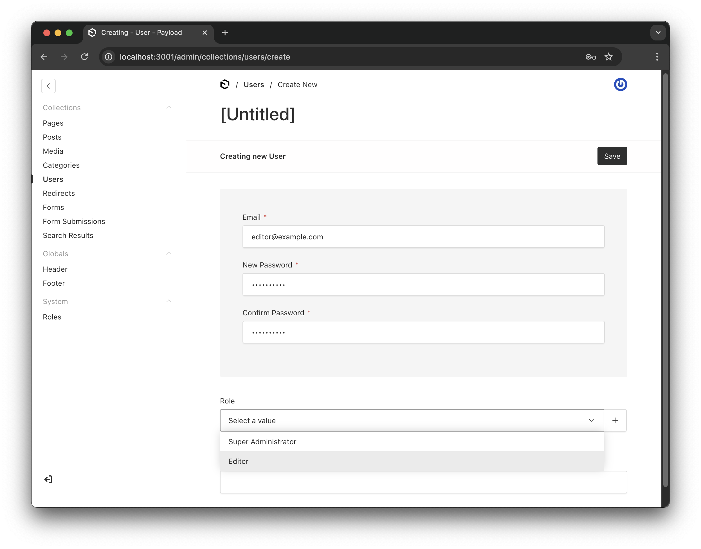
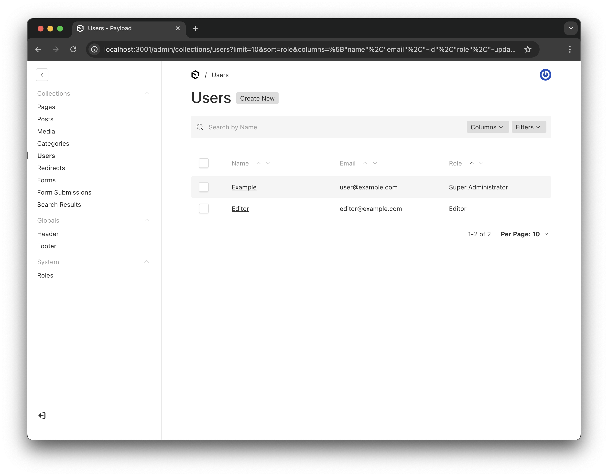
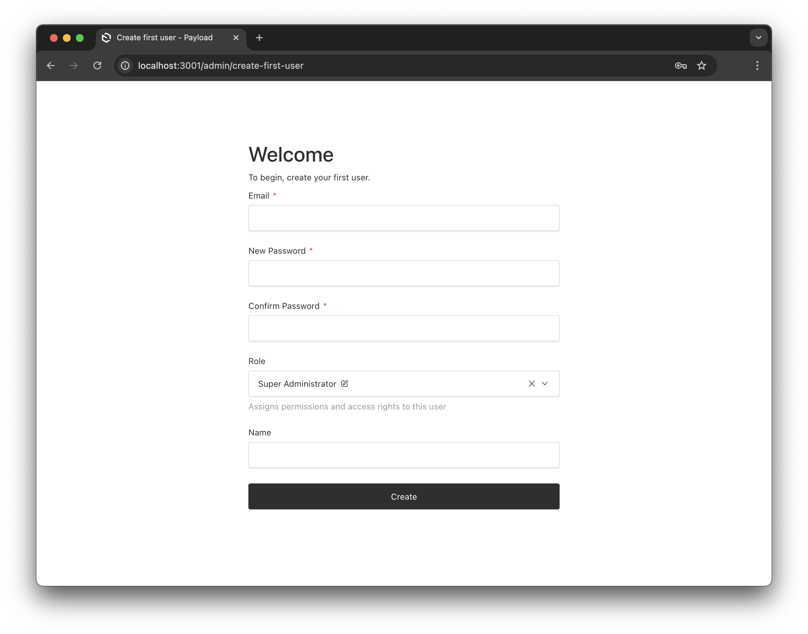
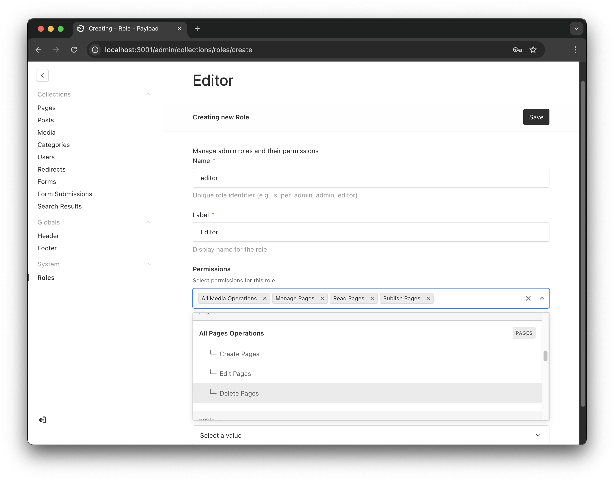
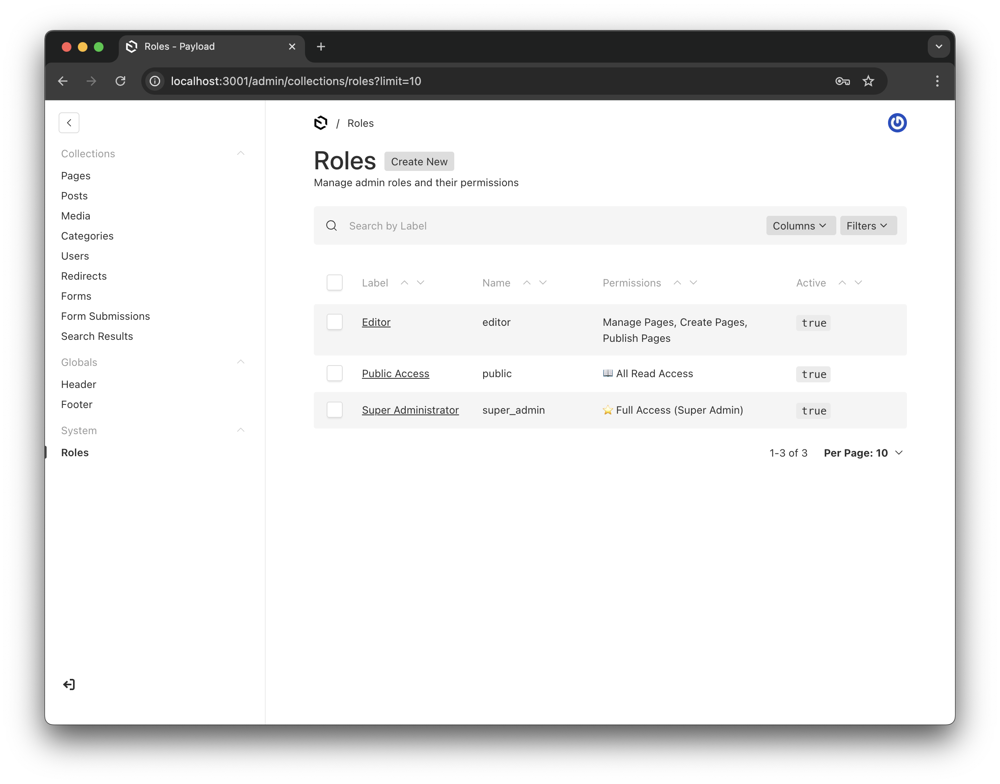
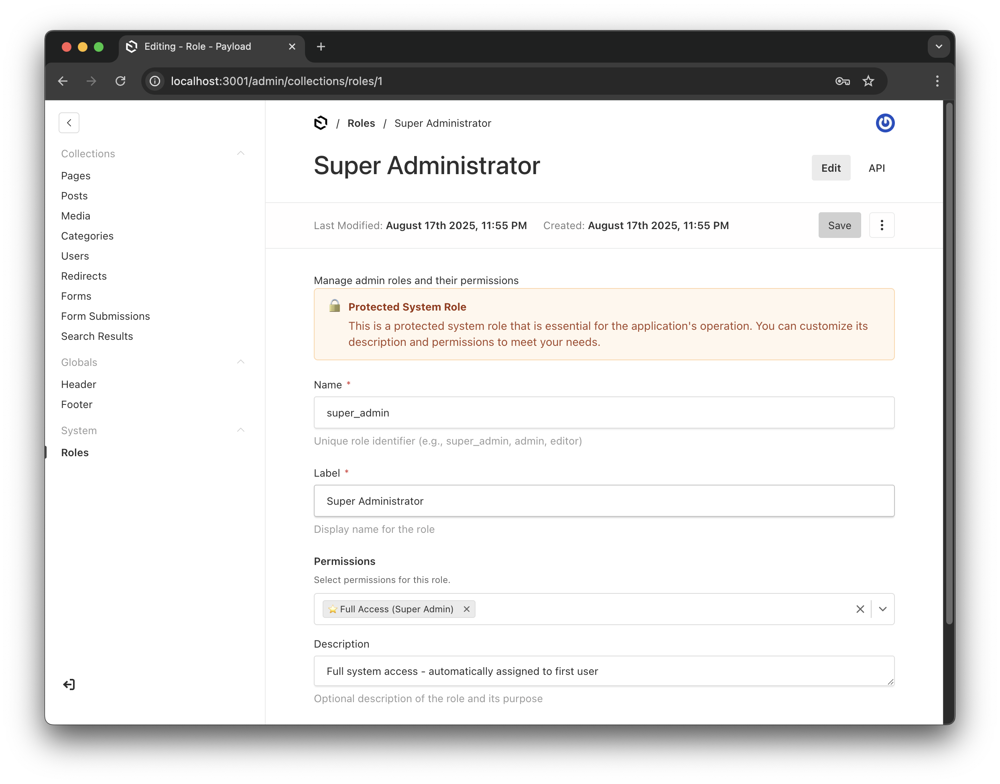

# Payload Gatekeeper
[](https://www.linkedin.com/in/sascha-seewald-1a065336/)
[](https://www.npmjs.com/package/payload-gatekeeper)
[](https://www.npmjs.com/package/payload-gatekeeper)
[](https://opensource.org/licenses/MIT)
[](https://www.typescriptlang.org/)
[](https://payloadcms.com/)

## Test Coverage & Quality

[](https://github.com/sSeewald/payload-gatekeeper/actions/workflows/ci.yml)
[](https://sSeewald.github.io/payload-gatekeeper/)
[](https://sSeewald.github.io/payload-gatekeeper/)
[](https://github.com/sSeewald/payload-gatekeeper/network/updates)

A comprehensive, production-ready permissions system with role-based access control, automatic permission generation, and flexible configuration options. Your collections' trusted guardian.

## Features

- 🔐 **Role-Based Access Control (RBAC)** - Define roles with specific permissions
- 🎯 **Automatic Permission Generation** - Permissions created for all collections automatically
- 🔄 **Permission Inheritance** - Support for wildcard permissions (`*`, `collection.*`)
- 🛡️ **Protected Roles** - Prevent modification of critical system roles
- 👁️ **UI Visibility Control** - Separate UI visibility from CRUD operations
- 🎨 **Flexible Role Assignment** - Permission-based role assignment (users can only assign roles with permissions they possess)
- 🔌 **Multiple Auth Collections** - Support for multiple user types (admin users, customers, etc.)
- 📍 **Flexible Field Placement** - Place role field anywhere in your collections (tabs, sidebar, custom position)
- 🎭 **Collection-Specific Role Visibility** - Roles can be shown only for relevant collections
- 🎨 **Custom Permissions** - Define your own application-specific permissions in organized groups
- ⚡ **Zero Config Start** - Works out of the box with sensible defaults
- 🔧 **Fully Typed** - Complete TypeScript support

## UI Overview

Payload Gatekeeper provides a clean and intuitive interface for managing roles and permissions:

### Roles Management

*The Roles collection showing system default roles - fully manageable through the UI*

### User Role Assignment

*Assigning roles when creating new users - with searchable dropdown*

### Users with Roles

*Users overview showing their assigned roles*

## Installation

```bash
npm install payload-gatekeeper
# or
yarn add payload-gatekeeper
# or
pnpm add payload-gatekeeper
```

## Quick Start

```typescript
// payload.config.ts
import { buildConfig } from 'payload'
import { gatekeeperPlugin } from 'payload-gatekeeper'

export default buildConfig({
  // ... your config
  plugins: [
    gatekeeperPlugin({
      // Minimal config - just enhance your admin collection
      collections: {
        'users': {
          enhance: true,
          autoAssignFirstUser: true,
        }
      },
      // Exclude collections from permission system entirely
      excludeCollections: ['special-config'] // These use their own access control
    })
  ]
})
```

### First User Setup
When `autoAssignFirstUser` is enabled, the first user automatically receives the super_admin role:


*The first user gets super admin privileges automatically*

## Configuration

### Full Configuration Example

```typescript
import { gatekeeperPlugin } from 'payload-gatekeeper'

export default buildConfig({
  plugins: [
    gatekeeperPlugin({
      // Configure specific collections
      collections: {
        'admin-users': {
          enhance: true,
          roleFieldPlacement: {
            tab: 'Security',      // Place in specific tab
            position: 'first',    // Position: 'first', 'last', 'sidebar', or number
          },
          autoAssignFirstUser: true,   // First user gets super_admin role
          defaultRole: undefined,      // No default role for admins
        },
        'customers': {
          enhance: true,
          roleFieldPlacement: {
            position: 'sidebar',  // Show in sidebar
          },
          autoAssignFirstUser: false,  // Don't make first customer super_admin
          defaultRole: 'customer',     // New signups get 'customer' role
        },
      },
      
      // Define system roles (in addition to super_admin)
      systemRoles: [
        {
          name: 'admin',
          label: 'Administrator',
          permissions: [
            // UI visibility permissions
            'users.manage',       // Shows Users in admin UI
            'products.manage',    // Shows Products in admin UI
            'media.manage',       // Shows Media in admin UI
            // CRUD permissions
            'users.*',           // All user operations
            'products.*',        // All product operations
            'media.*',           // All media operations
            // Exclude roles.* to prevent role management
          ],
          protected: false,      // Can be modified
          active: true,
          description: 'Full admin access without role management',
          visibleFor: ['admin-users'],  // Only visible for admin users
        },
        {
          name: 'editor',
          label: 'Content Editor',
          permissions: [
            'products.manage',    // Can see products in UI
            'products.read',
            'products.update',
            'media.*',
          ],
          active: true,
          description: 'Can edit content and media',
        },
        {
          name: 'customer',
          label: 'Customer',
          permissions: [
            'orders.read',        // Can view own orders (row-level handled separately)
            'customers.read',     // Can view own profile
            'customers.update',   // Can update own profile
          ],
          active: true,
          description: 'Default customer role',
          visibleFor: ['customers'],  // Only visible for customer users
        },
      ],
      
      // Optional: Exclude collections from permission system
      excludeCollections: ['public-pages'],
      
      // Environment-based options
      skipPermissionChecks: false,  // Set to true during seeding/migration
      syncRolesOnInit: process.env.SYNC_ROLES === 'true',
      
      // UI customization
      rolesGroup: 'Admin',  // Group name for Roles collection in admin panel (default: 'System')
      rolesSlug: 'roles',   // Custom slug for Roles collection (default: 'roles')
    })
  ]
})
```

## Core Concepts

### Public Access

Non-authenticated users automatically have configurable public access:

```typescript
// Default behavior - public can read all non-auth collections
gatekeeperPlugin({})

// Custom public permissions
gatekeeperPlugin({
  publicRolePermissions: [
    '*.read',           // Read all collections
    'comments.create',  // Can create comments
    'reactions.create'  // Can add reactions
  ]
})

// Completely private system
gatekeeperPlugin({
  disablePublicRole: true  // No public access at all
})
```

**Important:** Auth-enabled collections (users, admins) are ALWAYS protected from public access, regardless of public permissions.

### Role Management

The plugin automatically creates a Roles collection where you can manage all roles through the UI:


*Creating a new editor role with specific permissions*


*Roles collection showing both system and custom roles*

### Permission Patterns

The plugin supports various permission patterns:

- `*` - Super admin with access to everything
- `collection.*` - All operations on a specific collection
- `collection.read` - Specific operation on a collection
- `*.read` - Read access to all collections
- `collection.manage` - UI visibility permission (controls whether collection appears in admin panel)

### Protected Roles

Protected roles cannot be deleted and have restricted field updates. Only users with `*` permission can modify protected roles.

```typescript
const superAdminRole = {
  name: 'super_admin',
  permissions: ['*'],
  protected: true,  // Cannot be deleted, limited updates
}
```


*Protected super admin role showing the lock indicator and full permissions*

### UI Visibility vs CRUD Operations

The plugin separates UI visibility from CRUD operations:

- **`.manage` permission** - Controls whether a collection appears in the admin UI
- **CRUD permissions** (`.read`, `.create`, `.update`, `.delete`) - Control actual data operations

```typescript
// User can see the collection in UI but only read data
permissions: ['products.manage', 'products.read']

// User can perform operations but collection is hidden in UI
permissions: ['products.create', 'products.update']
```

## Custom Permissions

Define application-specific permissions that are automatically organized by namespace:

```typescript
import { gatekeeper } from 'payload-gatekeeper'

export default buildConfig({
  plugins: [
    gatekeeper({
      customPermissions: [
        // Event Management permissions (namespace: event-management)
        {
          label: 'Export Events',
          value: 'event-management.export',
          description: 'Export event data to CSV/Excel'
        },
        {
          label: 'Import Events',
          value: 'event-management.import',
          description: 'Import events from external sources'
        },
        {
          label: 'Manage Templates',
          value: 'event-management.templates',
          description: 'Create and manage event templates'
        },
        
        // Marketing permissions (namespace: marketing)
        {
          label: 'Send Newsletters',
          value: 'marketing.newsletters',
          description: 'Send marketing newsletters to users'
        },
        {
          label: 'Manage Campaigns',
          value: 'marketing.campaigns',
          description: 'Create and manage marketing campaigns'
        },
        
        // Analytics permissions (namespace: analytics)
        {
          label: 'View Analytics',
          value: 'analytics.view',
          description: 'View platform analytics and metrics'
        },
        {
          label: 'Export Reports',
          value: 'analytics.export',
          description: 'Export analytics reports'
        }
      ]
    })
  ]
})
```

### Using Custom Permissions

Custom permissions appear automatically in the Roles management UI, grouped by their namespace. Use them in your code:

```typescript
// In API endpoints or hooks
import { checkPermission } from 'payload-gatekeeper'

export const exportEventHandler = async (req, res) => {
  const canExport = await checkPermission(
    req.payload,
    req.user.role,
    'event-management.export',
    req.user.id
  )
  
  if (!canExport) {
    return res.status(403).json({ error: 'Not authorized to export events' })
  }
  
  // Export logic here...
}
```

### Namespace Formatting

The namespace (part before the dot) in the permission value is automatically extracted and formatted as the category:

- `event-management.export` → Category: "Event Management"
- `backend-users.impersonate` → Category: "Backend Users"
- `user-profiles.manage` → Category: "User Profiles"

This keeps your permissions organized in the UI without explicit grouping configuration.

### Custom Permissions Structure

- **Namespace**: The part before the dot becomes the category (e.g., `event-management`)
- **Operation**: The part after the dot is the specific operation (e.g., `export`)
- **Permissions**: Each permission has:
  - `label`: Display name in the UI
  - `value`: Unique identifier with namespace.operation format
  - `description`: Optional helper text shown in the UI

Custom permissions integrate seamlessly with the existing permission system, supporting the same wildcards and inheritance patterns.

### Permission-Based Role Assignment

Users can only assign roles whose permissions are a subset of their own:

- User with `users.*` and `media.*` can assign roles with `users.read` or `media.update`
- User with `users.*` cannot assign a role with `products.*` (they don't have product permissions)
- Only users with `*` permission can assign protected roles

## Multiple Collections Support

The plugin is designed to work seamlessly with multiple auth-enabled collections. Each collection can have its own:

- **Custom role field placement** - Place the role field in tabs, sidebar, or specific positions
- **Different default roles** - Assign different default roles to different user types
- **Auto-assignment rules** - Configure which collections auto-assign super_admin to first user
- **Independent permission checks** - Each collection's users are evaluated based on their assigned roles

### Why Multiple Collections?

Many applications need different types of users:
- **Admin Users** - Internal staff managing the platform
- **Customers** - End users of your application  
- **Vendors** - Third-party sellers or service providers
- **Partners** - External collaborators with limited access

Each can have their own collection with tailored fields, while sharing the same role-based permission system.

## Examples

### Basic Setup with Single Admin Collection

```typescript
gatekeeperPlugin({
  collections: {
    'users': {
      enhance: true,
      autoAssignFirstUser: true,
    }
  }
})
```

### Multiple User Types with Custom Field Placement

```typescript
gatekeeperPlugin({
  collections: {
    'admins': {
      enhance: true,
      roleFieldPlacement: { 
        tab: 'Security',        // Create/use 'Security' tab
        position: 'first'       // Place at the beginning of the tab
      },
      autoAssignFirstUser: true,
    },
    'customers': {
      enhance: true,
      roleFieldPlacement: { 
        position: 'sidebar'     // Show in the sidebar for easy access
      },
      defaultRole: 'customer',
    },
    'vendors': {
      enhance: true,
      roleFieldPlacement: {
        tab: 'Account',         // Place in existing 'Account' tab
        position: 2             // Place as third field (0-indexed)
      },
      defaultRole: 'vendor',
    },
    'partners': {
      enhance: true,
      roleFieldPlacement: {
        position: 'last'        // Place at the end of fields
      },
      defaultRole: 'partner',
    }
  },
  systemRoles: [
    // ... role definitions
  ]
})
```

### Custom Role Field Configuration

You can further customize the role field for each collection:

```typescript
gatekeeperPlugin({
  collections: {
    'users': {
      enhance: true,
      roleFieldConfig: {
        label: 'Access Level',           // Custom label
        admin: {
          description: 'Controls what this user can access in the system',
          position: 'sidebar',
          condition: (data) => data.active === true,  // Only show for active users
        }
      }
    }
  }
})
```

### Seeding Users

#### Simple: First Admin User (with autoAssignFirstUser)

When `autoAssignFirstUser: true` is configured, you don't need to search for roles - the first user automatically gets super_admin:

```typescript
// seed-admin.ts
import { getPayload } from 'payload'
import config from './payload.config'

async function seedFirstAdmin() {
  const payload = await getPayload({ config })

  try {
    // Check if any admin users exist
    const existingUsers = await payload.count({
      collection: 'users',
    })

    if (existingUsers.totalDocs > 0) {
      console.log('Admin users already exist, skipping seed')
      return
    }

    // Create the first admin user - automatically gets super_admin role!
    await payload.create({
      collection: 'users',
      data: {
        email: 'admin@example.com',
        password: 'SecurePassword123!',
        // No need to set role - autoAssignFirstUser handles it
      },
    })

    console.log('✅ First admin user created with super_admin role')
  } catch (error) {
    console.error('Error seeding admin:', error)
  }

  process.exit(0)
}

seedFirstAdmin()
```

#### Advanced: Multiple Users with Specific Roles

Only search for roles when you need to create additional users with specific roles:

```typescript
// seed-users.ts
async function seedUsers() {
  const payload = await getPayload({ config })

  try {
    // Find specific roles for additional users
    const editorRole = await payload.find({
      collection: 'roles',
      where: { name: { equals: 'editor' } },
      limit: 1,
    })

    const viewerRole = await payload.find({
      collection: 'roles',
      where: { name: { equals: 'viewer' } },
      limit: 1,
    })

    // Create editor user
    if (editorRole.docs.length > 0) {
      await payload.create({
        collection: 'users',
        data: {
          email: 'editor@example.com',
          password: 'EditorPass123!',
          role: editorRole.docs[0].id,
        },
      })
    }

    // Create viewer user
    if (viewerRole.docs.length > 0) {
      await payload.create({
        collection: 'users',
        data: {
          email: 'viewer@example.com',
          password: 'ViewerPass123!',
          role: viewerRole.docs[0].id,
        },
      })
    }

    console.log('✅ Additional users created')
  } catch (error) {
    console.error('Error seeding users:', error)
  }
}

seedUsers()
```

### Custom Permission Checks in Your Code

```typescript
import { checkPermission, hasPermission } from 'payload-gatekeeper'

// In your custom endpoint or hook
async function myCustomEndpoint(req: PayloadRequest) {
  // Check if user has specific permission
  const canEdit = await checkPermission(
    req.payload,
    req.user.role,
    'products.update',
    req.user.id
  )
  
  if (!canEdit) {
    throw new Error('Unauthorized')
  }
  
  // Direct permission check (if you have the permissions array)
  const permissions = req.user.role?.permissions || []
  const canDelete = hasPermission(permissions, 'products.delete')
}
```

## API Reference

### Plugin Options

| Option | Type | Description | Default |
|--------|------|-------------|---------|
| `collections` | `object` | Collection-specific configuration | `{}` |
| `systemRoles` | `array` | Roles to create/sync on init | `[]` |
| `excludeCollections` | `string[]` | Collections to exclude from permission system | `[]` |
| `disablePublicRole` | `boolean` | Disable public access for non-authenticated users | `false` |
| `publicRolePermissions` | `string[]` | Custom permissions for public users | `['*.read']` |
| `skipPermissionChecks` | `boolean \| (() => boolean)` | Skip permission checks (for seeding/migration) | `false` |
| `syncRolesOnInit` | `boolean` | Force role sync on every init | `false` |
| `rolesGroup` | `string` | UI group name for Roles collection | `'System'` |
| `rolesSlug` | `string` | Custom slug for Roles collection | `'roles'` |

### Collection Configuration

| Option | Type | Description | Default |
|--------|------|-------------|---------|
| `enhance` | `boolean` | Add role field to collection | `false` |
| `roleFieldPlacement` | `object` | Where to place the role field | `undefined` |
| `autoAssignFirstUser` | `boolean` | Assign super_admin to first user | `false` |
| `defaultRole` | `string` | Default role for new users | `undefined` |

### Utility Functions

#### `checkPermission(payload, userRole, permission, userId?)`
Checks if a user has a specific permission. Handles role loading and wildcard matching.

#### `hasPermission(permissions, requiredPermission)`
Direct permission check against an array of permissions. Supports wildcards.

#### `canAssignRole(userPermissions, targetRole)`
Checks if a user can assign a specific role based on permission subset logic.

## Advanced Usage

### Collection-Specific Role Visibility

Control which roles appear in the role selection dropdown for each collection:

```typescript
gatekeeperPlugin({
  collections: {
    'backend-users': {
      enhance: true,
      autoAssignFirstUser: true,  // Makes this an "admin collection"
    },
    'customers': {
      enhance: true,
      defaultRole: 'customer',
    }
  },
  systemRoles: [
    {
      name: 'admin',
      label: 'Administrator',
      permissions: ['users.*'],
      visibleFor: ['backend-users'],  // Only shown for backend-users
    },
    {
      name: 'customer',
      label: 'Customer',
      permissions: ['orders.read'],
      visibleFor: ['customers'],  // Only shown for customers
    },
    {
      name: 'viewer',
      label: 'Read-Only Access',
      permissions: ['*.read'],
      // No visibleFor = shown for all collections
    }
  ]
})
```

**Intelligent Super Admin Visibility**: The Super Admin role is automatically set to be visible only for collections with `autoAssignFirstUser: true` (admin collections). This prevents customers or other non-admin users from seeing or being assigned the Super Admin role.

### Custom Collection Name (Compatibility)

If you already have a `roles` collection in your project, you can configure the plugin to use a different slug:

```typescript
gatekeeperPlugin({
  rolesSlug: 'admin-roles',  // Use 'admin-roles' instead of 'roles'
  rolesGroup: 'Admin',       // Optional: also change the UI group
  // ... other config
})
```

**Note:** When using a custom slug, make sure to update any references in your seed scripts or custom code.

### Custom Permissions

You can add custom permissions beyond CRUD operations:

```typescript
systemRoles: [
  {
    name: 'moderator',
    permissions: [
      'comments.approve',    // Custom permission
      'comments.flag',       // Custom permission
      'users.ban',          // Custom permission
    ]
  }
]
```

### Wrapper Pattern

The plugin wraps existing access control, allowing collections to maintain their own logic:

```typescript
// Your collection's existing access control still works
const Products: CollectionConfig = {
  access: {
    read: ({ req }) => {
      // Your custom logic here
      return req.user?.company === 'allowed-company'
    }
  }
}

// Plugin adds permission check on top:
// 1. First checks permission (products.read)
// 2. Then checks your custom logic
// Both must pass for access to be granted
```

### Using Environment Variables

The plugin doesn't read environment variables directly. You need to configure them in your plugin options:

```typescript
// payload.config.ts
gatekeeperPlugin({
  // Use environment variables in your config
  syncRolesOnInit: process.env.SYNC_ROLES === 'true',
  skipPermissionChecks: process.env.SKIP_PERMISSIONS === 'true',
  
  // Or use a function for dynamic control
  skipPermissionChecks: () => process.env.NODE_ENV === 'seed',
})
```

Then run your application with environment variables:

```bash
# Force role synchronization
SYNC_ROLES=true npm run dev

# Skip permissions during seeding
NODE_ENV=seed npm run seed

# Development mode (auto-syncs roles when NODE_ENV=development)
NODE_ENV=development npm run dev
```

## Security Considerations

1. **First User Setup**: The first user in an auth-enabled collection with `autoAssignFirstUser: true` automatically receives the super_admin role
2. **Protected Roles**: Super admin role is protected by default and cannot be deleted
3. **Permission Escalation Prevention**: Users cannot assign roles with permissions they don't possess
4. **Wildcard Permissions**: Use wildcards carefully - `*` grants complete system access

## Production Deployment

1. **Initial Setup**: 
   - Deploy application
   - Start application to create roles (happens automatically on first request)
   - Run seed script to create first admin user

2. **Role Management**:
   - System roles are synced on first start or when none exist
   - In production, roles are not auto-synced unless explicitly configured
   - Manage roles through the admin UI after initial setup

3. **Backup Considerations**:
   - Always backup your `roles` collection before updates
   - Protected roles provide safety against accidental deletion

## TypeScript Support

The plugin is fully typed. Types are automatically generated for your roles and permissions:

```typescript
import type { Role, Permission } from 'payload-gatekeeper'

// Your role documents will have proper typing
const role: Role = {
  name: 'admin',
  permissions: ['users.*', 'products.read'],
  // ...
}
```

## Testing

```bash
# Run all tests
npm test

# Run tests with coverage report
npm run test:coverage

# Run tests in watch mode
npm run test:watch

# Run specific test file
npm test checkUIVisibility
```

### Test Coverage Thresholds

The project maintains high test coverage standards:

| Type | Threshold | Current |
|------|-----------|---------|
| Lines | 80% | 90.73% ✅ |
| Branches | 80% | 85.17% ✅ |
| Functions | 80% | 82.5% ✅ |
| Statements | 80% | 90.73% ✅ |

## Development

```bash
# Install dependencies
npm install

# Build the plugin
npm run build

# Run linting
npm run lint

# Fix linting issues
npm run lint:fix

# Type checking
npm run typecheck

# Run all quality checks
npm run ci
```

### Project Structure

```
src/
├── access/           # Access control utilities
├── collections/      # Roles collection definition
├── components/       # React components (role selector)
├── hooks/           # Payload hooks (beforeChange, afterChange, etc.)
├── utils/           # Utility functions
├── types.ts         # TypeScript type definitions
├── constants.ts     # Constants and defaults
├── defaultRoles.ts  # System default roles
└── index.ts         # Main plugin export
```

## CI/CD Integration

### GitHub Actions Example

```yaml
name: CI

on: [push, pull_request]

jobs:
  test:
    runs-on: ubuntu-latest
    steps:
      - uses: actions/checkout@v3
      - uses: actions/setup-node@v3
        with:
          node-version: '20'
      - run: npm ci
      - run: npm run lint
      - run: npm run typecheck
      - run: npm run test:coverage
      - uses: codecov/codecov-action@v3
        with:
          files: ./coverage/lcov.info
```

## License

MIT License - see LICENSE file for details

## Contributing

Contributions are welcome! Please read our contributing guidelines before submitting PRs.

### Development Workflow

1. Fork the repository
2. Create your feature branch (`git checkout -b feature/amazing-feature`)
3. Write tests for your changes
4. Ensure all tests pass (`npm test`)
5. Check coverage (`npm run test:coverage`)
6. Lint your code (`npm run lint`)
7. Commit your changes (`git commit -m 'Add amazing feature'`)
8. Push to the branch (`git push origin feature/amazing-feature`)
9. Open a Pull Request

## Support

For issues, questions, or suggestions, please open an issue on GitHub.

## Acknowledgments

Built with ❤️ for the [Payload CMS](https://payloadcms.com/) community.
